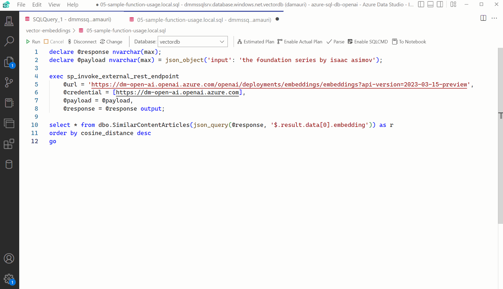

# Vector similarity search with Azure SQL & Azure OpenAI

This example shows how to use Azure OpenAI from Azure SQL database to get the vector embeddings of any choosen text, and then calculate the [cosine similarity](https://learn.microsoft.com/en-us/azure/storage/common/storage-sas-overview) against the Wikipedia articles (for which vector embeddings have been already calculated,) to find the articles that covers topics that are close - or similar - to the provided text.

For an introduction on text and code embeddings, check out this OpenAI article: [Introducing text and code embeddings](https://openai.com/blog/introducing-text-and-code-embeddings).

Azure SQL database can be used to significatly speed up vectors operations using column store indexes, so that search can have sub-seconds performances even on large datasets.



## Download and import the Wikipedia Article with Vector Embeddings

Download the [wikipedia embeedings from here](https://cdn.openai.com/API/examples/data/vector_database_wikipedia_articles_embedded.zip), unzip it and upload it (using [Azure Storage Explorer](https://learn.microsoft.com/azure/vs-azure-tools-storage-manage-with-storage-explorer?tabs=windows) for example) to an Azure Blob Storage container.

In the example the unzipped csv file to `vector_database_wikipedia_articles_embedded.csv` is assumed to be uploaded to a blob container name `playground` and in a folder named `wikipedia`.

Once the file is uploaded, get the [SAS token](https://learn.microsoft.com/azure/storage/common/storage-sas-overview) to allow Azure SQL database to access it. (From Azure storage Explorer, right click on the `playground` container and than select `Get Shared Access Signature`. Set the expiration date to some time in future and then click on "Create". Copy the generated query string somewhere, for example into the Notepad, as it will be needed later)

Use a client tool like [Azure Data Studio](https://azure.microsoft.com/products/data-studio/) to connect to an Azure SQL database and then use the `./vector-embeddings/01-import-wikipedia.sql` to create the `wikipedia_articles_embeddings` where the uploaded CSV file will be imported.

Make sure to replace the `<account>` and `<sas-token>` placeholders with the value correct for your environment:

- `<account>` is the name of the storage account where the CSV file has been uploaded
- `<sas-token>` is the Share Access Signature obtained before

Run each section (each section starts with a comment) separately. At the end of the process (will take a few minutes) you will have all the CSV data imported in the `wikipedia_articles_embeddings` table.

## Create Vectors Table

In the imported data, vectors are stored as JSON arrays. To take advtange of vector processing, the arrays must be saved into a columnstore index. Thanks to `OPENJSON`, turning a vector into a set of values that can be saved into a column is very easy:

```sql
 select 
    v.id as article_id,    
    cast(tv.[key] as int) as vector_value_id,
    cast(tv.[value] as float) as vector_value   
from 
    [dbo].[wikipedia_articles_embeddings] as v
cross apply 
    openjson(title_vector) tv
```

The script `./vector-embeddings/02-create-vectors-table.sql` does exactly that. It creates two tables, one for the title embeddings and one for the content embeddings, and the creates a clustered columnstore on those tables to enable efficient vector processing.

## Find similar articles calculating cosine distance

The third script `./vector-embeddings/03-find-similar-articles.sql` starts invoking OpenAI to get the vector embeddings of an arbitrary text. 

Make sure to have an Azure OpenAI [embeddings model](https://learn.microsoft.com/azure/cognitive-services/openai/concepts/models#embeddings-models) deployed and make sure it is using the `text-embedding-ada-002` model.

Once the Azure OpenAI model is deployed, it can be called from Azure SQL database using [sp_invoke_external_rest_endpoint](https://learn.microsoft.com/sql/relational-databases/system-stored-procedures/sp-invoke-external-rest-endpoint-transact-sql), to get the embedding vector for the "the foundation series by isaac asimov", text, for example, using the following code (make sure to replace the <api-key> with yout Azure OpenAI deployment):

```sql
declare @inputText nvarchar(max) = 'the foundation series by isaac asimov';
declare @retval int, @response nvarchar(max);
declare @payload nvarchar(max) = json_object('input': @inputText);
exec @retval = sp_invoke_external_rest_endpoint
    @url = 'https://<your-app-name>.openai.azure.com/openai/deployments/<deployment-id>/embeddings?api-version=2023-03-15-preview',
    @method = 'POST',
    @headers = '{"api-key":"<api-key>"}',
    @payload = @payload,
    @response = @response output;
select @response;
```

The response can be turned into a table using the `OPENJSON` function again:

```sql
select 
    cast([key] as int) as [vector_value_id],
    cast([value] as float) as [vector_value]
into    
    #t
from 
    openjson(@response, '$.result.data[0].embedding')
```

Now is just a matter of taking the vector of the sample text and the vectors of all wikipedia articles and calculate the cosine similarity. The math can be easily expressed in T-SQL:

```sql
SUM(v1.[vector_value] * v2.[vector_value]) / 
(
    SQRT(SUM(v1.[vector_value] * v1.[vector_value])) 
    * 
    SQRT(SUM(v2.[vector_value] * v2.[vector_value]))
)
```

thanks to columnstore, even on small SKU, the performance can be pretty fast, well within the sub-second goal.

## Conclusions

Azure SQL database, and by extension SQL Server, already has a great support for vector operations thanks to columnstore and its usage of [SIMD](https://en.wikipedia.org/wiki/Single_instruction,_multiple_data) [AVX-512 instructions](https://www.intel.com/content/www/us/en/architecture-and-technology/avx-512-overview.html). 

A vector is nothing more than a list numbers (in this scope) and list of numbers can be perfectly stored in a column and even better in a columnstore index. You can start to take advantange of optimized vectors operations right now, directly in Azure SQL database, taking also advantage of all other features that it offers to developers.
